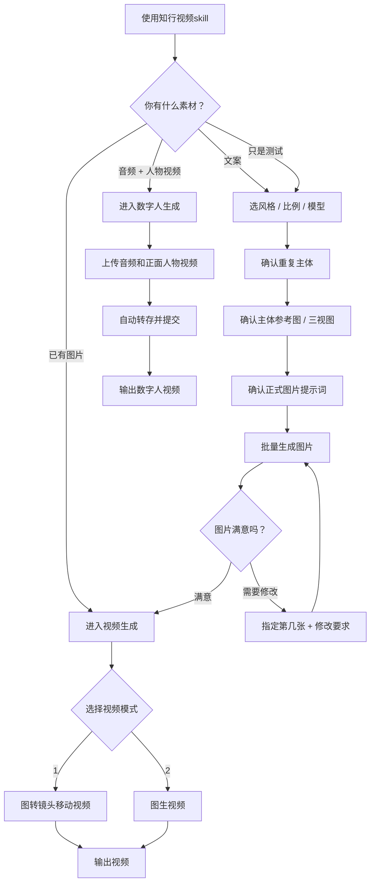

# SOP：如何使用知行视频skill

这份 SOP 教用户安装后怎么使用 `知行视频skill`。

你只需要记住 3 件事：

1. 先用 `使用知行视频skill` 唤醒。
2. 按系统的问题一步一步回复。
3. 不满意就说清楚“第几张 / 哪个主体 / 怎么改”。

## 一句话开始

最推荐的开场：

```text
使用知行视频skill，帮我从文案开始做视频。
```

如果你只是想测试：

```text
使用知行视频skill，你一步一步带我走。
```

如果你要做数字人：

```text
使用知行视频skill，帮我做数字人。
```

## 流程图



最常用路线：

```text
文案 -> 选风格/模型 -> 确认主体 -> 确认提示词 -> 生图 -> 确认图片 -> 视频生成
```

## 用户要准备什么

至少准备其中一种：

- 文案
- 图片
- 音频
- 正面人物视频

效果更稳定的材料：

- 主讲人照片
- 主讲人三视图
- 风格参考图
- 主要角色参考图

## 常用场景怎么说

### 1. 从文案开始做图片

```text
使用知行视频skill，先带我走图片流程。

文案是：
[粘贴你的文案]
```

### 2. 从文案一路做到视频

```text
使用知行视频skill，帮我从文案开始做视频。

文案是：
[粘贴你的文案]
```

### 3. 已经有图片，继续做视频

```text
使用知行视频skill，这些图片已经确认，帮我进入视频生成。
```

### 4. 做数字人

```text
使用知行视频skill，帮我做数字人。
```

然后上传：

- 音频
- 正面人物视频

### 5. 只看提示词，不真实生图

```text
使用知行视频skill，只生成图片提示词，先不要生图。
```

## 每一步怎么回复

### 选择风格

系统问：

```text
使用风格模版请输入 1
自主设定风格请输入 2
```

你可以回复：

```text
1
```

或者自己描述风格：

```text
2，风格参考我上传的图，只参考风格，不参考人物。比例 16:9，模型 GPT-Image-2。
```

### 确认主体

如果主体清单没问题：

```text
1
```

如果要修改：

```text
2，主讲人参考我上传的照片；OpenClaw 使用小龙虾形象。
```

### 确认三视图或主体参考图

满意：

```text
2
```

不满意：

```text
1，修改小龙虾，让它更可爱，不要机甲风。
```

### 确认正式图片提示词

没问题：

```text
全部生图
```

要修改：

```text
第 3 张提示词改一下，画面要更像科技发布会，不要办公室。
```

### 图片生成后

满意并进入视频：

```text
2
```

修改指定图片：

```text
第 5 张，人物太远了，改成半身近景。
```

### 视频生成

系统问：

```text
1 图转镜头移动视频模式
2 图生视频模式
```

想要稳定镜头移动，回复：

```text
1
```

想要 AI 动态视频，回复：

```text
2
```

## 最小测试文案

第一次测试可以直接复制：

```text
使用知行视频skill，测试完整图片流程。

文案是：
AI 正在改变普通人的创业方式。
以前创业需要团队、资金和资源，
现在一个人也可以借助 AI 完成内容、流量和交付。
```

建议第一次只测试到图片生成，不要一开始就跑完整视频和数字人。

## 关键规则

- 不需要记内部模块名。
- 不需要一次性说完所有要求。
- 系统问什么，你答什么。
- 主体不满意，先改主体，再进入正式生图。
- 图片不满意，指定第几张修改。
- 图片确认后，再进入视频生成。
- 数字人只需要上传音频和正面人物视频。
